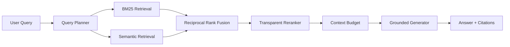

# 🧠 Agentic RAG Engine V2

A inspectable Retrieval-Augmented Generation engine with **document chunking, BM25-style lexical search, semantic retrieval, reciprocal-rank fusion, multi-query planning, transparent reranking, context budgeting, citations, evaluation, FastAPI, Docker, and OpenAI-compatible model adapters**.

## Architecture



## What is implemented

- typed `Document`, `Chunk`, scored-result and trace models
- deterministic overlapping document chunking
- real BM25-style lexical index
- deterministic offline embedding provider for reproducible CI
- OpenAI-compatible `/v1/embeddings` adapter for real local/cloud embedding servers
- cosine semantic retrieval
- reciprocal-rank fusion across lexical, semantic and planned-query rankings
- deterministic multi-query decomposition for compound questions
- interpretable reranker with a replaceable cross-encoder boundary
- token-budgeted citation context construction
- offline grounded extractive generation
- OpenAI-compatible `/v1/chat/completions` generator for real LLMs
- Recall@K, Precision@K, MRR and Hit Rate evaluation
- FastAPI indexing, retrieval and answer endpoints
- latency and retrieval tracing
- Docker support
- compatibility layer for the original V1 API
- automated tests and GitHub CI

## Quick start

```bash
pip install -e ".[dev]"
pytest -q
uvicorn rag_engine.api:app --reload
```

Open `http://localhost:8000/docs`.

## API

- `GET /health`
- `POST /v1/documents/index`
- `POST /v1/retrieve`
- `POST /v1/answer`

## Use a real OpenAI-compatible model server

The default configuration is fully offline so tests and demos are reproducible. To connect Ollama/vLLM/LM Studio or another OpenAI-compatible gateway, configure the following environment variables:

```bash
export RAG_EMBEDDING_BASE_URL=http://localhost:11434
export RAG_EMBEDDING_MODEL=nomic-embed-text
export RAG_CHAT_BASE_URL=http://localhost:11434
export RAG_CHAT_MODEL=qwen3
export RAG_API_KEY=
```

The engine automatically switches from the deterministic offline providers to the configured model endpoints.

## Why this project matters

This repository is intentionally built beyond the common `embed → vector search → prompt` demo. The retrieval path separates planning, lexical search, semantic search, fusion, reranking, context construction, generation and evaluation so each stage can be tested, benchmarked and replaced independently.

## Next engineering milestones

- persistent Qdrant/pgvector adapter
- learned cross-encoder reranker
- LLM-driven query decomposition and iterative retrieval
- ingestion workers for PDF/HTML/Markdown
- groundedness and citation-faithfulness evaluation
- OpenTelemetry-compatible tracing
- benchmark datasets and regression gates

Built as an engineering portfolio project focused on production GenAI systems.

## Scope and limitations

Offline embeddings use token hashing, not a trained semantic model. The reranker and query planner are deterministic heuristics. Indexes live in memory and are rebuilt during ingestion. Input is already-extracted text; PDF/OCR/HTML ingestion is not implemented. Citations identify supplied context but do not establish answer faithfulness. The small synthetic retrieval test is a regression fixture, not a general retrieval benchmark. Remote adapters require an independently hosted compatible service and are not validated against live providers by offline CI.

## Installation and development

Requires Python 3.12 or newer. Run from this project directory.

```bash
python -m venv .venv
source .venv/bin/activate
python -m pip install -e ".[dev]"
python -m ruff check .
python -m pytest -q
python -m pip wheel --no-deps . -w dist
```

On Windows, activate with `.venv\Scripts\Activate.ps1`.

## Library usage

```python
from rag_engine.models import Document
from rag_engine.service import RAGEngine

engine = RAGEngine()
engine.index([Document("memory", "SQLite stores persistent conversation memory.")])
print(engine.answer("What stores conversation memory?"))
```

## Configuration

See [.env.example](.env.example). Export variables into the process environment; the application does not automatically load that file. Keep real credentials out of Git.

## Service and API schema

```bash
python -m uvicorn rag_engine.api:app --host 127.0.0.1 --port 8000
```

Interactive endpoint schemas are at `http://127.0.0.1:8000/docs`; machine-readable schemas are at `/openapi.json`. These APIs have no built-in authentication. Use trusted local data and local access.

## Container

```bash
docker build -t agentic-rag-engine .
docker run --rm -p 127.0.0.1:8000:8000 agentic-rag-engine
```

## Repository structure

| Path | Purpose |
| --- | --- |
| `src/rag_engine/` | Implementation |
| `tests/` | Offline unit and regression tests |
| `docs/DESIGN.md` | Architecture and trust boundaries |
| `.github/workflows/ci.yml` | Install, lint, tests, wheel and container build |
| `pyproject.toml` | Dependencies and package configuration |

## Next engineering work

Persistent index adapter; labeled retrieval benchmark; citation-faithfulness checks; trained reranker; background ingestion. These are planned work, not current capabilities.

## Contributing and security

See [CONTRIBUTING.md](CONTRIBUTING.md) and [SECURITY.md](SECURITY.md). The standalone CI workflow runs after migration; while nested in the profile repository, the parent CI validates this project.

## License and provenance

[MIT](LICENSE), copyright 2026 Maharshi Patel. This public portfolio implementation is independent of employer systems and contains no confidential employer code or data. Examples and test fixtures are synthetic.
