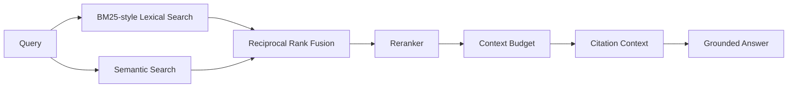

# 🧠 Agentic RAG Engine

Production-style Retrieval-Augmented Generation with **hybrid search, reranking, citations, evaluation and agent-ready orchestration**.

## Why this is different

Most demos stop at `embed → vector search → prompt`. This project implements a more realistic retrieval stack:



### Implemented

- document chunking with overlap
- typed domain models
- BM25-inspired lexical retrieval
- deterministic offline embedding provider
- semantic cosine search
- reciprocal-rank fusion
- transparent reranking
- context-budget selection
- citation-ready grounded answers
- Recall@K / Precision@K / MRR / Hit Rate
- FastAPI service
- Docker
- tests + CI
- security/evaluation architecture

The default embedding provider is deliberately offline and deterministic so CI is reproducible. The provider interface is designed for real embedding backends later.

## Quick start

```bash
pip install -e ".[dev]"
pytest -q
uvicorn agentic_rag.api.app:app --reload
```

Open `http://localhost:8000/docs`.

## API

- `GET /health`
- `POST /v1/documents/index`
- `POST /v1/retrieve`
- `POST /v1/answer`

## Roadmap

- real sentence-transformer / cloud embedding adapters
- persistent vector stores
- cross-encoder reranking
- query decomposition
- iterative retrieval agents
- groundedness and citation-faithfulness evaluation
- tracing and production benchmarks

Built from scratch as a public engineering portfolio project.
