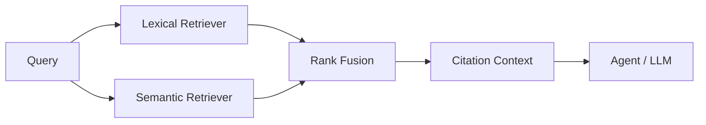

# 🧠 Agentic RAG Engine

A compact retrieval engine demonstrating **lexical + semantic-style scoring, reciprocal-rank fusion, citation-ready context assembly and evaluation hooks**.

## Implemented

- document chunk model
- BM25-inspired lexical scorer
- deterministic embedding-like scorer for offline tests
- reciprocal rank fusion
- citation formatter
- retrieval metrics
- unit tests

## Architecture

The semantic scorer is intentionally deterministic and dependency-light for the public starter. Swap it with a real embedding backend through the same interface.
