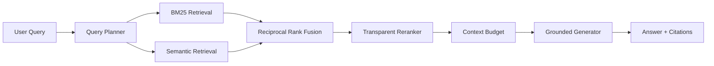

# 🧠 Agentic RAG Engine V2

A production-oriented Retrieval-Augmented Generation engine with **document chunking, BM25-style lexical search, semantic retrieval, reciprocal-rank fusion, multi-query planning, transparent reranking, context budgeting, citations, evaluation, FastAPI, Docker, and OpenAI-compatible model adapters**.

## Architecture



## What is implemented

- typed `Document`, `Chunk`, scored-result and trace models
- deterministic overlapping document chunking
- real BM25-style lexical index
- deterministic offline embedding provider for reproducible CI
- OpenAI-compatible `/v1/embeddings` adapter for real local/cloud embedding servers
- cosine semantic retrieval
- reciprocal-rank fusion across lexical, semantic and planned-query rankings
- deterministic multi-query decomposition for compound questions
- interpretable reranker with a replaceable cross-encoder boundary
- token-budgeted citation context construction
- offline grounded extractive generation
- OpenAI-compatible `/v1/chat/completions` generator for real LLMs
- Recall@K, Precision@K, MRR and Hit Rate evaluation
- FastAPI indexing, retrieval and answer endpoints
- latency and retrieval tracing
- Docker support
- compatibility layer for the original V1 API
- automated tests and GitHub CI

## Quick start

```bash
pip install -e ".[dev]"
pytest -q
uvicorn rag_engine.api:app --reload
```

Open `http://localhost:8000/docs`.

## API

- `GET /health`
- `POST /v1/documents/index`
- `POST /v1/retrieve`
- `POST /v1/answer`

## Use a real OpenAI-compatible model server

The default configuration is fully offline so tests and demos are reproducible. To connect Ollama/vLLM/LM Studio or another OpenAI-compatible gateway, configure the following environment variables:

```bash
export RAG_EMBEDDING_BASE_URL=http://localhost:11434
export RAG_EMBEDDING_MODEL=nomic-embed-text
export RAG_CHAT_BASE_URL=http://localhost:11434
export RAG_CHAT_MODEL=qwen3
export RAG_API_KEY=
```

The engine automatically switches from the deterministic offline providers to the configured model endpoints.

## Why this project matters

This repository is intentionally built beyond the common `embed → vector search → prompt` demo. The retrieval path separates planning, lexical search, semantic search, fusion, reranking, context construction, generation and evaluation so each stage can be tested, benchmarked and replaced independently.

## Next engineering milestones

- persistent Qdrant/pgvector adapter
- learned cross-encoder reranker
- LLM-driven query decomposition and iterative retrieval
- ingestion workers for PDF/HTML/Markdown
- groundedness and citation-faithfulness evaluation
- OpenTelemetry-compatible tracing
- benchmark datasets and regression gates

Built as an engineering portfolio project focused on production GenAI systems.
