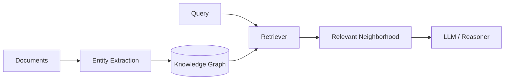

# 🌐 Knowledge Twin

A compact **knowledge graph + retrieval** engine for representing entities, relationships and evidence.

## Implemented

- typed entities and edges
- graph traversal
- neighborhood expansion
- simple semantic keyword retrieval over entity descriptions
- evidence-aware relationship formatting
- tests

## Architecture

