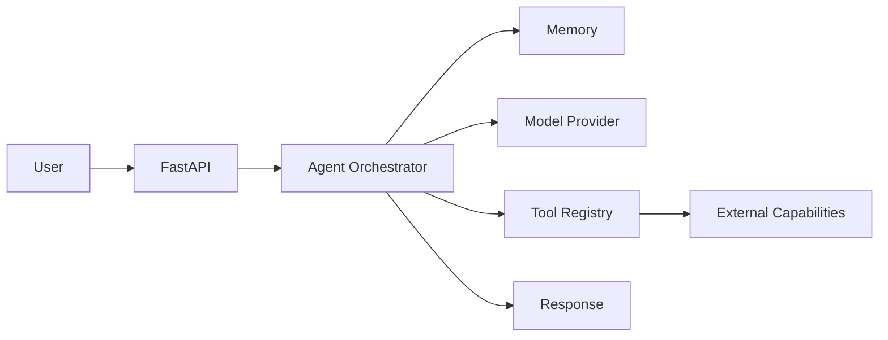

# 🦾 Mak'ma AI OS

A production-minded foundation for a personal AI operating system built around **agents, memory, tools, policy-aware actions and model-provider abstraction**.

## What is implemented

- async agent orchestrator
- in-memory session memory
- provider protocol with local echo provider
- extensible tool registry
- FastAPI service
- tests
- Docker support

## Architecture



## Run

```bash
python -m venv .venv
source .venv/bin/activate
pip install -e ".[dev]"
uvicorn makma.main:app --reload
```

Then open `http://localhost:8000/docs`.

## Roadmap

- real model-provider adapters
- structured tool calling
- RAG
- semantic long-term memory
- multimodal input
- approval-gated computer tools
- evaluation and tracing

This is a clean public implementation built from scratch and contains no private employer code or data.
