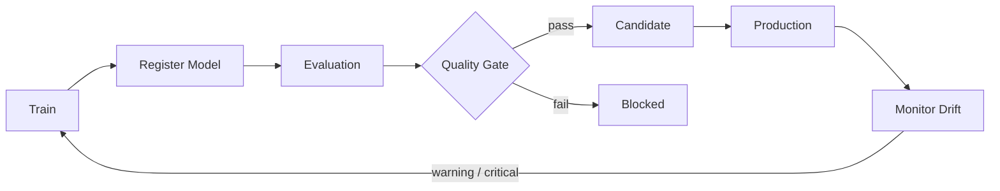

# ⚙️ MLOps Control Plane

A compact model lifecycle control plane for **registration, quality gates, promotion and drift monitoring**.

## Implemented

- model artifact registry
- SHA-256 dataset fingerprints
- evaluation records
- promotion policy
- stage transitions
- Population Stability Index (PSI)
- drift severity classification
- append-only JSON state store
- FastAPI service
- tests
- Docker

## Lifecycle



## Why this project matters

The interesting part of production ML is not just training a model. Teams need to answer:

- Which dataset produced this artifact?
- Which metrics were used to approve it?
- Why was a model promoted?
- Which model is currently in production?
- What happens to the previous production version?
- Is the live data distribution drifting?

This project makes that lifecycle explicit and inspectable.

## Example

```python
from mlops_cp.models import Evaluation, ModelVersion
from mlops_cp.registry import ModelRegistry

registry = ModelRegistry()

registry.register(
    ModelVersion(
        name="churn",
        version="1.2.0",
        artifact_uri="s3://models/churn/1.2.0",
        dataset_fingerprint="sha256:...",
    )
)

registry.add_evaluation(
    "churn",
    "1.2.0",
    Evaluation(
        metric="roc_auc",
        value=0.91,
        threshold=0.85,
    ),
)

decision = registry.promote_candidate("churn", "1.2.0")

if decision.allowed:
    registry.promote_production("churn", "1.2.0")
```

## Roadmap

- MLflow adapter
- real artifact store
- approval workflow
- canary deployment policy
- shadow evaluation
- rollback history
- OpenTelemetry traces
- Prometheus metrics
- cloud deployment templates
