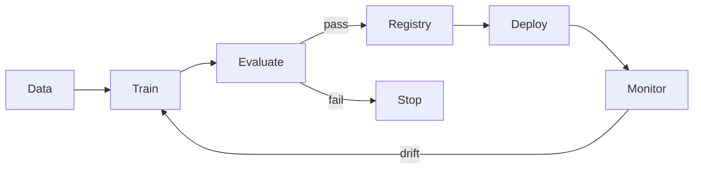

# ⚙️ MLOps Production Pipeline

A compact project demonstrating the lifecycle around a machine-learning model: **training, versioned metadata, evaluation gates and drift monitoring**.

## Implemented

- deterministic linear-regression trainer
- model artifact metadata
- evaluation threshold gate
- population stability index (PSI)
- unit tests
- container support

## Pipeline

The implementation is dependency-light so the mechanics are inspectable. Production adapters can later connect the same lifecycle to MLflow, cloud registries and managed serving.
