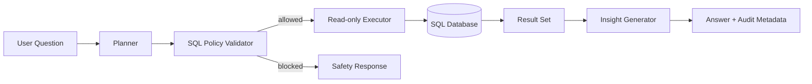

# 🔐 Secure Data Copilot

A production-minded **read-only analytics copilot** for relational data. The system is designed around a strict rule: an AI assistant may help reason over business data, but it must not silently gain write access to the database.

## Implemented

- schema introspection for SQLite
- read-only SQL policy engine
- multi-statement blocking
- row-limit enforcement
- query audit metadata
- typed query plans
- deterministic local planner baseline
- execution timing
- automatic numeric summaries
- FastAPI service
- tests
- Docker

## Architecture



## Why this project matters

Many "chat with your database" demos give a model a database connection and hope for the best. This project instead separates **planning, policy, execution, observation and interpretation**.

The included planner is deterministic so the repository works offline and its tests are reproducible. A model-backed planner can later implement the same contract without weakening the safety boundary.

## Quick start

```bash
python -m venv .venv
source .venv/bin/activate
pip install -e ".[dev]"
python examples/bootstrap_demo.py
uvicorn data_copilot.api:app --reload
```

Open `http://localhost:8000/docs`.

## Example

```json
{
  "question": "show the top customers by revenue",
  "database_path": "examples/demo.db"
}
```

## Security model

Only `SELECT` and `WITH ... SELECT` queries are accepted. Write, DDL, privileged, multi-statement and oversized queries are blocked before execution. SQLite is also opened in native read-only mode.

This is defense in depth, not a claim that string-level validation is a complete SQL sandbox. A production PostgreSQL version should combine AST validation with a dedicated least-privilege database role.

## Roadmap

- structured LLM planner adapter
- PostgreSQL adapter
- SQL AST validation with sqlglot
- semantic business metrics layer
- row/column-level authorization
- chart specifications
- query-result caching
- OpenTelemetry traces
